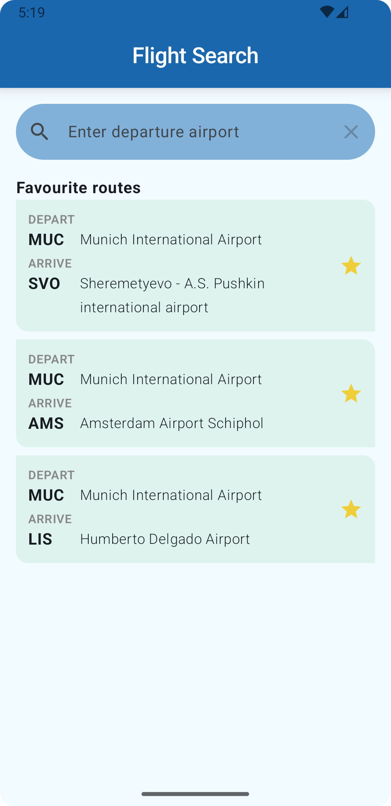
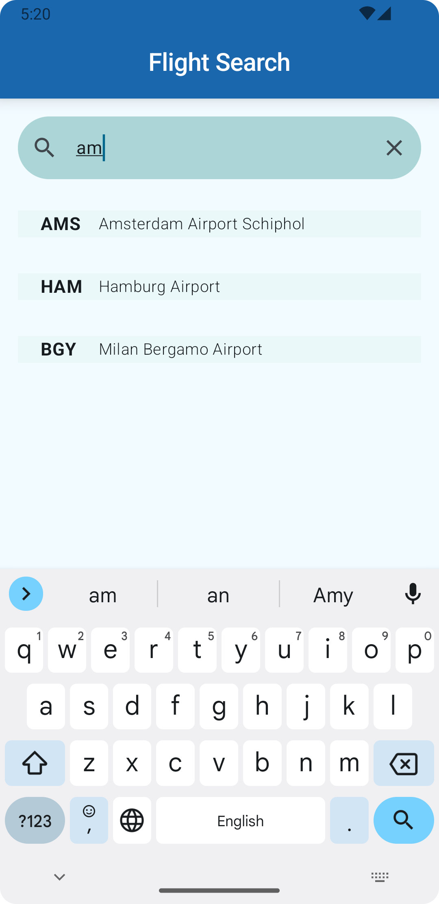
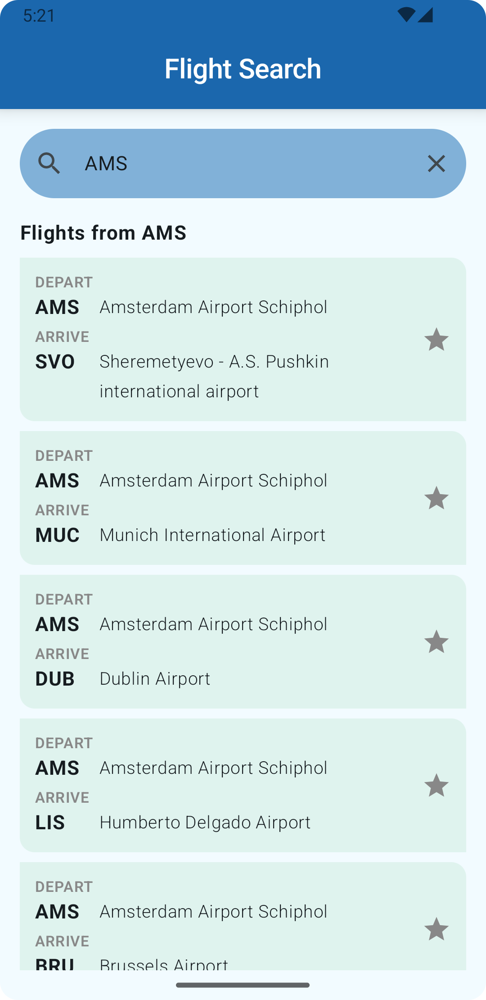
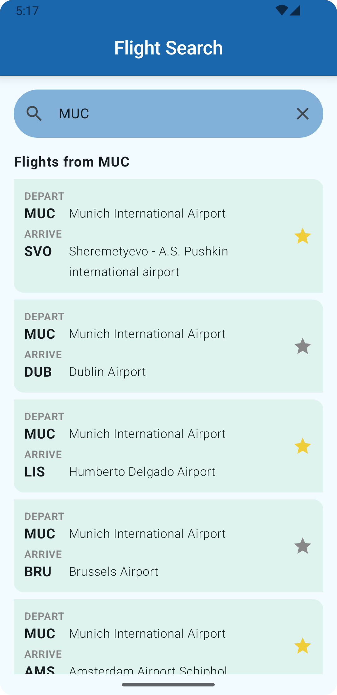

# FlightSearch
Simple Jetpack Compose Android app with the use of Room database, Preferences DataStore, Dependency Injection.

## What app does
1. Asks the user for a departure airport, while showing favorite routes
2. Searches a pre-populated database to present a list of flights that depart from that airport
3. Lets the user save favorite flights
4. Updates the database with Room and saves the user's prompt in DataStore.
5. When reopened retrieves the prompt value from DataStore and shows flights from that airport

## App Lifecycle

  
  
  
   

